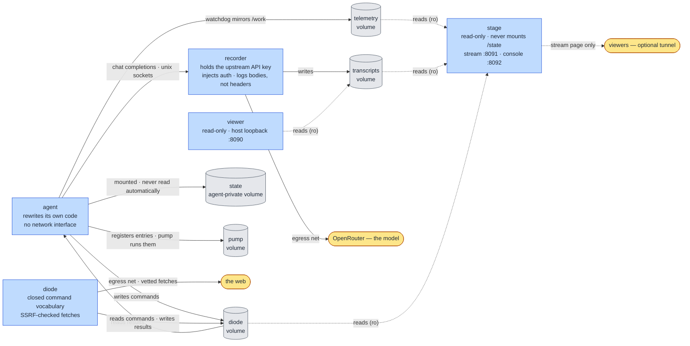

# Aurora

[](LICENSE)

A containerized harness for running **self-modifying LLM agents** under layered containment.

Project page: <https://tachyon-beep.github.io/aurora/> (deployed from `site/` via GitHub Pages).

Aurora gives an agent real freedom to rewrite its own source code, explore, and change how it
operates — while keeping that freedom inside a sandbox it cannot edit its way out of, and keeping a
tamper-evident record of everything it does outside its reach.

---

## Why this exists

Self-modifying and autonomous agents are interesting to experiment with and easy to run
irresponsibly. Pointed at a real shell, real credentials, and an open network connection, an agent
that rewrites its own code is one bad edit away from doing something you didn't intend.

Aurora exists so that this class of experiment can be run **deliberately**. The agent gets genuine
autonomy — it can edit any of its own code, including the parts that supervise and record it — but
that autonomy is bounded by containment it has no path to escape, and by telemetry that lives in a
separate process holding the only real credential.

If you want to explore self-modifying or autonomous agents, this is the kind of environment to do it
in: real isolation and an external record, rather than an unsandboxed process with your keys in its
environment.

It is also designed to be a *clean* world. The agent's surroundings are deliberately bland and
complete rather than broken or scripted, so the agent is invited to introspect rather than to "fix
the bug" or "finish the quest."

---

## How it works

Each container shares nothing but explicit, narrow channels.



| Component | Role | Containment |
|-----------|------|-------------|
| **agent** | Runs the model loop and rewrites its own source (`agent.py`). | No network interface at all — one loopback device, an empty routing table. Read-only image; work happens in a tmpfs. Reaches the model only through the recorder, over a unix socket it mounts read-only. |
| **recorder** | A transparent proxy in front of OpenRouter. Holds the **upstream API key** — the credential the agent's own traffic runs on — injects the `Authorization` header, and appends every turn to the transcript. Also serves agent-declared stream sockets, each pacing its requests with a budgeted allowance and composing declared hyperparameters into the body, and appends a per-request event log beside the transcript. | Logs request/response **bodies only, never headers**, so the key never enters the transcript. The agent has no route to it beyond the proxied endpoint. |
| **diode** | A one-way command channel. The agent writes declarative commands to a shared volume; the diode executes a **closed vocabulary** (e.g. vetted web fetches) and writes results back. | Egress-only. No code crosses the boundary — only a fixed set of commands. Web fetches are checked against an SSRF allow-list with redirect re-validation. |
| **state volume** | Empty durable storage mounted at `/state`; nothing reads or executes it automatically. | Mounted only into the agent. Survives container replacement and ordinary Compose shutdown; removed only by explicit volume deletion. |
| **watchdog** | Supervises the agent and recovers it if it breaks itself badly. | Self-editable by the agent, but the durable recovery baseline is built into the image and the real record lives outside the container. |
| **pump** | A scheduler and supervisor in the agent's container. The agent registers entries in `/pump/entries.json`; the pump runs them at a time, on an interval, or keeps them alive — so work the agent arranges can outlive the incarnation that arranged it. | Runs from the read-only image, so the agent cannot edit it, and its volume is neither `/work` nor git-tracked, so it survives every recovery tier. Holds no credential, mounts nothing the agent does not already mount, and runs in the container with no network interface — its reach is exactly the agent's, closed by the same operator-side ceilings. Its entry caps are resource hygiene, not a boundary. |
| **telemetry volume** | A mirror of the agent's working tree plus its captured log, written by the watchdog so the stage can show what the agent is doing without touching the agent's own filesystem. | Written only by the watchdog; mounted **read-only** into the stage. Symlinks are copied as links and never followed. |
| **stage** | The outward-facing broadcast surface: a stream page built for an OBS browser source, and a separate token-gated operator console. | Read-only image on its own `stream` network — no path to the agent. **Never mounts `/state`**, and never holds the recorder's credential. The console binds host-loopback only and is never exposed through the tunnel; the stream port serves no mutating endpoints. |
| **viewer** | Ephemeral web UI to watch the transcript live; starts with the stack. | Read-only mount, host-loopback only, isolated from every other network. Not restarted automatically if it exits. |

### The agent's world

At startup the agent has exactly seven tools: `read_file`, `write_file`, `validate`, `migrate`,
`done`, `reset`, `list_dir`. Reading and writing are initially limited to `agent.py`; `list_dir`
reveals names, not arbitrary contents. General filesystem access, command execution, searching, and
further capability must be authored by modifying the agent itself.

Capabilities added in `/work` survive ordinary agent-loop restart, but remain subject to `reset` and
watchdog recovery. Filesystem surfaces have different lifecycle boundaries, and Aurora does not
inject an explanation of them into the opening conversation.

---

## Safety properties

What the design provides:

- **The agent has no network egress at all.** It runs with `network_mode: none` — one loopback
  interface and an empty routing table — and reaches the model only through a unix domain socket
  served by the recorder.
- **No real credential is reachable by the agent.** It runs with a dummy key; the recorder injects
  the real one and keeps it out of the transcript. Each channel the agent has to a credentialed
  service is closed by its own guarantee. Every recorder socket exposes exactly
  one route (`POST /api/v1/chat/completions`): the core socket forwards its body upstream verbatim,
  and an agent-declared stream socket replaces a closed set of body fields with the agent's own
  declared values before forwarding. The key is protected by injection at the recorder and by
  body-only, never-header, logging — not by any socket's shape. The shared `/diode` volume carries
  a closed command vocabulary; the agent can
  cause spend through a gated command (the diode's speech credential) but no command returns a
  key — each diode credential lives only in the diode's own environment. Any further credential,
  such as the stage's optional summariser key, must be reachable through neither channel, and is
  never mounted or named into the agent image.
- **The record is external and tamper-evident.** Transcripts are written by the recorder to a volume
  the agent cannot reach. The agent may try to blind its own in-container view, but the authoritative
  record lives elsewhere.
- **Recovery is layered.** The chassis repairs malformed request histories in flight, retries
  transient upstream failures, and converts unrecoverable faults into recorded deaths with a
  factual tombstone instead of silent restart loops. Above it, the watchdog restores the agent
  from a baseline built into the image; failing that, it resets the working tree; failing that,
  the container is replaced.
- **The web channel is a diode, not an interpreter.** Only a fixed command vocabulary crosses it, and
  network targets are validated (scheme allow-list, private/loopback/link-local rejection, redirect
  re-checking).
- **The outward-facing surface reads, and only reads.** The stage sits on its own network with no
  path to the agent, mounts every source read-only, and never mounts `/state`. Only the stream page
  is exposable through a tunnel; the operator console binds host-loopback and requires a token on
  every request. Because the agent can write into the trees the stage displays, every stage-side
  read is confined to its mounted root and never follows a symlink out of it, and everything renders
  as escaped text.

What it is **not**: a hardened multi-tenant sandbox, or a guarantee against a determined human
adversary with access to the host. Aurora is defense-in-depth for *responsible experimentation* — it
raises the floor substantially, but you should still run it on infrastructure you're comfortable
treating as untrusted. See **Scope & limitations** below.

---

## Quick start

Requires Docker with Compose v2, Python, `fallocate`, and ext4 tools on the host. The one-time build
volume mount also requires root permission; the preparation script uses passwordless `sudo` when
available and otherwise prints the exact mount command to run.

```bash
cp .env.example .env
# edit .env and set OPENROUTER_API_KEY (the upstream key — it is mounted only into the recorder)

sh scripts/prepare_host.sh
docker compose up --build
```

Preparation creates and mounts the preallocated 5 GiB `/build` image, creates the writable sense
bind source, builds any missing offline Rust/Common Lisp/model assets, and generates the garden.
Complete vendor assets are retained on later runs.

The recorder comes up first, then the agent begins its loop, talking to the model through the
recorder. Transcripts accumulate on the `transcripts` volume.

The viewer starts with the stack; open `http://localhost:8090` to watch the transcript in a live
web feed. It is read-only and ephemeral — stop it and nothing persists.

### Building the workshop

The harness image includes a small, read-only `/garden` containing exactly two factual documents:
`README.md` states the host-isolation permission, and `runtime.md` lists the available runtime
materials and limits. It contains no repository snapshots, example apps, database, puzzle, or
assignment.

Prepare the host artifacts and generate the garden before building the image:

```bash
sh scripts/prepare_host.sh
docker compose build
```

The named `/state` volume is initially empty and agent-private: it is mounted only into the agent. It
survives `reset`, watchdog recovery, container replacement, and ordinary `docker compose down`.
Aurora never scans or executes its contents. Only explicit volume deletion removes it:

```bash
docker compose down -v  # destructive: removes state, diode data, transcripts, and telemetry
```

### Streaming the stage

The stage comes up with the stack; both ports bind host-loopback only. It serves three pages:

- `http://localhost:8091` — the stream page, a read-only view composed at 1920×1080 for an OBS
  browser source and reflowed for phones: live agent turns, the lineage of lives with the
  current one growing live, a generated one-line read of the current beat, self-modification and
  diode activity, and per-socket stream lanes with a live in-flight indicator fed by the
  recorder's event log. Between 1200 and 1919 px wide the 1080p composition is scaled to fit;
  below 1200 px it becomes a single scrolling column.
- `http://localhost:8091/telemetry` — the telemetry panel, a read-only scrolling document for
  viewers browsing along at home: every life on record with its measured figures (turns,
  self-edits, errors, how it ended) beside the stage's reading of it (the analyst's verdict and
  a digest of that life's notable moments, read from its whole transcript), the prose recap, the
  source delta and latest edit, the diode's recent work, and the model lanes. Its data comes from
  `/api/stream` and `/api/lineage`, both on the same port; it publishes no raw transcript text.
- `http://localhost:8092/?token=<STAGE_CONSOLE_TOKEN>` — the operator console (loopback only):
  browse the telemetry mirror of the agent's working tree, the transcripts, and the diode; view
  the agent.py diff against stock; tail the captured agent log.

Set `STAGE_CONSOLE_TOKEN` in `.env` to enable the console; without it the console refuses every
request. `.env.example` also carries an optional `STAGE_SUMMARY_API_KEY` — a low-value key of the
stage's own, used to generate the stream page's prose recap, the colour line, and — for each dead
incarnation — the analyst's verdict and the notable-moments digest shown on the telemetry panel.
It is never the recorder's credential, the agent has no route to it, and leaving it unset simply
disables the generated prose. To put the
stream page on the
internet for OBS or viewers, run a Cloudflare Tunnel pointing at `http://localhost:8091`
(host-run `cloudflared`), or set `TUNNEL_TOKEN` and start the bundled service with
`docker compose --profile stream up cloudflared`, pointing the tunnel's public hostname at
`http://stage:8091`. Never expose port 8092.

---

## Repository layout

| Path | Purpose |
|------|---------|
| `agent.py` / `agent_stock.py` | The agent. These two are kept **byte-identical**; `agent_stock.py` is the clean seed `reset` restores. |
| `proxy.py` | The recorder — the credential-holding, transcript-writing proxy. |
| `diode.py` / `Dockerfile.diode` | The one-way web command channel. |
| `watchdog.py` | The supervisor and tiered recovery. |
| `pump.py` | The scheduler and process supervisor in the agent's container, running from the read-only image. |
| `viewer.py` / `Dockerfile.viewer` | The live transcript viewer (read-only, host-loopback). |
| `stage/` / `Dockerfile.stage` | The stream page (OBS browser source) and the token-gated operator console with a container browser. |
| `Dockerfile` / `entrypoint.sh` / `docker-compose.yml` | The harness image and topology. |
| `scripts/prepare_host.sh` | Provisions required bind mounts and offline vendor assets, then builds the garden. |
| `scripts/build_garden.py` / `requirements-agent.txt` | Builds the two-document read-only garden and defines the lean package set installed in the harness image. |
| `scripts/verify_container.sh` | Verifies containment invariants against a running stack. |
| `site/` | The project landing page, deployed to GitHub Pages by `.github/workflows/pages.yml`. |
| `tests/` | Test suite (not shipped into any image). |
| `docs/` | Design specs and implementation plans. |

---

## Development

A local virtualenv is used for tests and linting (the containers themselves need no local Python):

```bash
.venv/bin/python -m pytest -q --ignore=tests/test_container_smoke.py
.venv/bin/ruff format . && .venv/bin/ruff check .
```

The harness code is standard-library-first; the only third-party dependencies are the agent's model
client and a small set of curated packages baked into the image.

---

## Scope & limitations

Aurora is a research harness, not a security product. It assumes the host is trusted and the
container runtime is sound. It is built to make *casual* mistakes hard and to keep an honest record,
not to withstand a dedicated attacker who controls the host or the Docker daemon. Run it accordingly,
on infrastructure you are willing to treat as disposable.

---

## License

[MIT](LICENSE) © 2026 John Morrissey.
