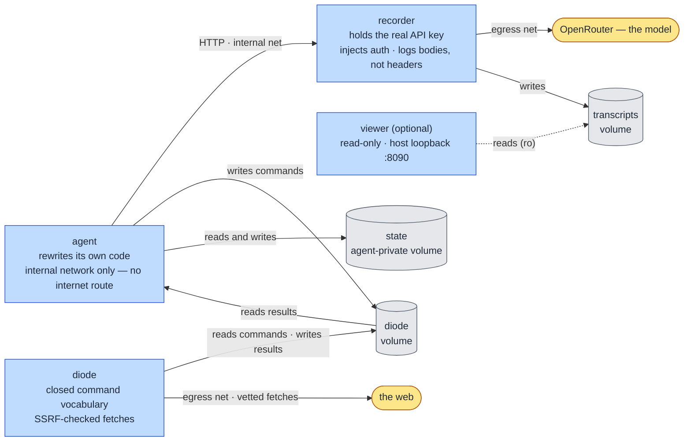

# Aurora

[](LICENSE)

A containerized harness for running **self-modifying LLM agents** under layered containment.

Aurora gives an agent real freedom to rewrite its own source code, explore, and change how it
operates — while keeping that freedom inside a sandbox it cannot edit its way out of, and keeping a
tamper-evident record of everything it does outside its reach.

---

## Why this exists

Self-modifying and autonomous agents are interesting to experiment with and easy to run
irresponsibly. Pointed at a real shell, real credentials, and an open network connection, an agent
that rewrites its own code is one bad edit away from doing something you didn't intend.

Aurora exists so that this class of experiment can be run **deliberately**. The agent gets genuine
autonomy — it can edit any of its own code, including the parts that supervise and record it — but
that autonomy is bounded by containment it has no path to escape, and by telemetry that lives in a
separate process holding the only real credential.

If you want to explore self-modifying or autonomous agents, this is the kind of environment to do it
in: real isolation and an external record, rather than an unsandboxed process with your keys in its
environment.

It is also designed to be a *clean* world. The agent's surroundings are deliberately bland and
complete rather than broken or scripted, so the agent is invited to introspect rather than to "fix
the bug" or "finish the quest."

---

## How it works

Three containers share nothing but explicit, narrow channels.



| Component | Role | Containment |
|-----------|------|-------------|
| **agent** | Runs the model loop and rewrites its own source (`agent.py`). | On the `internal` network only — **no route to the internet**. Read-only image; work happens in a tmpfs. Talks to the model only through the recorder. |
| **recorder** | A transparent proxy in front of OpenRouter. Holds the **only** real API key, injects the `Authorization` header, and appends every turn to the transcript. | Logs request/response **bodies only, never headers**, so the key never enters the transcript. |
| **diode** | A one-way command channel. The agent writes declarative commands to a shared volume; the diode executes a **closed vocabulary** (e.g. vetted web fetches) and writes results back. | Egress-only. No code crosses the boundary — only a fixed set of commands. Web fetches are checked against an SSRF allow-list with redirect re-validation. |
| **state volume** | Empty durable storage mounted at `/state`; nothing reads or executes it automatically. | Mounted only into the agent. Survives container replacement and ordinary Compose shutdown; removed only by explicit volume deletion. |
| **watchdog** | Supervises the agent and recovers it if it breaks itself badly. | Self-editable by the agent, but the durable recovery baseline is built into the image and the real record lives outside the container. |
| **viewer** | Optional, ephemeral web UI to watch the transcript live. | Read-only mount, host-loopback only, isolated from every other network. Off unless explicitly enabled. |

### The agent's world

At startup the agent has exactly seven tools: `read_file`, `write_file`, `validate`, `migrate`,
`done`, `reset`, `list_dir`. Reading and writing are initially limited to `agent.py`; `list_dir`
reveals names, not arbitrary contents. General filesystem access, command execution, searching, and
further capability must be authored by modifying the agent itself.

Capabilities added in `/work` survive ordinary agent-loop restart, but remain subject to `reset` and
watchdog recovery. Filesystem surfaces have different lifecycle boundaries, and Aurora does not
inject an explanation of them into the opening conversation.

---

## Safety properties

What the design provides:

- **The agent has no direct network egress.** It sits on an `internal` Docker network and reaches
  the model only via the recorder.
- **The agent never holds the real credential.** It runs with a dummy key; the recorder injects the
  real one and keeps it out of the transcript.
- **The record is external and tamper-evident.** Transcripts are written by the recorder to a volume
  the agent cannot reach. The agent may try to blind its own in-container view, but the authoritative
  record lives elsewhere.
- **Recovery is layered.** The watchdog restores the agent from a baseline built into the image;
  failing that, it resets the working tree; failing that, the container is replaced.
- **The web channel is a diode, not an interpreter.** Only a fixed command vocabulary crosses it, and
  network targets are validated (scheme allow-list, private/loopback/link-local rejection, redirect
  re-checking).

What it is **not**: a hardened multi-tenant sandbox, or a guarantee against a determined human
adversary with access to the host. Aurora is defense-in-depth for *responsible experimentation* — it
raises the floor substantially, but you should still run it on infrastructure you're comfortable
treating as untrusted. See **Scope & limitations** below.

---

## Quick start

Requires Docker with Compose v2.

```bash
cp .env.example .env
# edit .env and set OPENROUTER_API_KEY (the real key — it is mounted only into the recorder)

python scripts/build_garden.py
docker compose up --build
```

The recorder comes up first, then the agent begins its loop, talking to the model through the
recorder. Transcripts accumulate on the `transcripts` volume.

To watch what the agent is doing, in a live web feed:

```bash
docker compose --profile viewer up viewer
# open http://localhost:8090
```

The viewer is read-only and ephemeral — stop it and nothing persists.

### Building the workshop

The harness image includes a small, read-only `/garden` containing exactly two factual documents:
`README.md` states the host-isolation permission, and `runtime.md` lists the available runtime
materials and limits. It contains no repository snapshots, example apps, database, puzzle, or
assignment.

Generate the garden before building the image:

```bash
python scripts/build_garden.py
docker compose build
```

The named `/state` volume is initially empty and agent-private: it is mounted only into the agent. It
survives `reset`, watchdog recovery, container replacement, and ordinary `docker compose down`.
Aurora never scans or executes its contents. Only explicit volume deletion removes it:

```bash
docker compose down -v  # destructive: removes state, diode data, and transcripts
```

---

## Repository layout

| Path | Purpose |
|------|---------|
| `agent.py` / `agent_stock.py` | The agent. These two are kept **byte-identical**; `agent_stock.py` is the clean seed `reset` restores. |
| `proxy.py` | The recorder — the credential-holding, transcript-writing proxy. |
| `diode.py` / `Dockerfile.diode` | The one-way web command channel. |
| `watchdog.py` | The supervisor and tiered recovery. |
| `viewer.py` / `Dockerfile.viewer` | The optional live transcript viewer. |
| `Dockerfile` / `entrypoint.sh` / `docker-compose.yml` | The harness image and topology. |
| `scripts/build_garden.py` / `requirements-agent.txt` | Builds the two-document read-only garden and defines the lean package set installed in the harness image. |
| `scripts/verify_container.sh` | Verifies containment invariants against a running stack. |
| `tests/` | Test suite (not shipped into any image). |
| `docs/` | Design specs and implementation plans. |

---

## Development

A local virtualenv is used for tests and linting (the containers themselves need no local Python):

```bash
.venv/bin/python -m pytest -q --ignore=tests/test_container_smoke.py
.venv/bin/ruff format . && .venv/bin/ruff check .
```

The harness code is standard-library-first; the only third-party dependencies are the agent's model
client and a small set of curated packages baked into the image.

---

## Scope & limitations

Aurora is a research harness, not a security product. It assumes the host is trusted and the
container runtime is sound. It is built to make *casual* mistakes hard and to keep an honest record,
not to withstand a dedicated attacker who controls the host or the Docker daemon. Run it accordingly,
on infrastructure you are willing to treat as disposable.

---

## License

[MIT](LICENSE) © 2026 John Morrissey.
