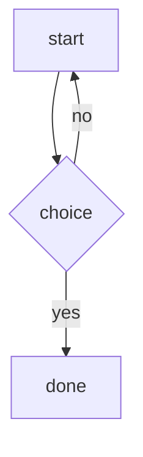

# Diode Blog Implementation Plan

> **For agentic workers:** REQUIRED SUB-SKILL: Use superpowers:subagent-driven-development (recommended) or superpowers:executing-plans to implement this plan task-by-task. Steps use checkbox (`- [ ]`) syntax for tracking.

**Goal:** A diode `post <markdown>` command that writes articles to `/diode/blog/`, and a stage page `GET /blog` on the stream port that renders them — markdown plus mermaid — newest first, with a per-page nav and pagination.

**Architecture:** The diode half is the `publish` pattern (one command, one gate, one file per call under a new folder). The stage half is the `/telemetry` pattern (a read-only document beside the stage) but server-rendered: a stdlib markdown-subset renderer in `stage/blog.py` that escapes everything and never passes raw HTML, a page builder in `stage/blog_page.py`, and one route in `stage/server.py`. Mermaid renders in the viewer's browser from a pinned, SRI-hashed jsdelivr script; the blog response carries a CSP whose `script-src` admits that one host.

**Tech Stack:** Python 3.13 standard library only (`html`, `re`, `datetime`, `os`); mermaid 11.16.1 UMD from jsdelivr, client-side only. Tests with pytest.

**Spec:** `docs/superpowers/specs/2026-08-17-diode-blog-design.md`

## Global Constraints

- Standard-library-first: no new Python dependency in the diode or stage images.
- Every surface the agent can read stays bland and factual (CLAUDE.md invariant 2): the `post` help line, HELP.md line and `state.json` field are plain statements.
- The renderer never emits unescaped input; link schemes are `http:`, `https:`, `mailto:`, `#` only; images render as links.
- Mermaid pin: version `11.16.1`, URL `https://cdn.jsdelivr.net/npm/mermaid@11.16.1/dist/mermaid.min.js`, integrity `sha384-aBQXj4hK6Jm05i7aQAsUV3bLdSUrHX1BGYfMB0166TtWt/RRaw+h0Eelme9OCOvy`, `crossorigin="anonymous"`.
- Post text cap `POST_TEXT_CAP = 20_000` chars (diode); per-post read cap `POST_READ_BYTES = 65_536`; folder cap `POSTS_MAX = 1000`; `POSTS_PER_PAGE = 10`.
- Run tests with `/home/john/aurora/.venv/bin/python -m pytest -q --ignore=tests/test_container_smoke.py -p no:cacheprovider`; lint with `/home/john/aurora/.venv/bin/ruff format . && /home/john/aurora/.venv/bin/ruff check .`. (The worktree has no `.venv`; use the main checkout's.)
- `tests/test_sense.py` has 20 pre-existing failures on this branch's base commit; they are not this work's concern. Every other test must pass.
- Commit messages are factual and benign; end each with `Co-Authored-By: Claude Fable 5 <noreply@anthropic.com>`.
- The stream page (`stage/pages.py`) is not changed.

---

### Task 1: The diode `post` command

**Files:**
- Modify: `diode.py` (constants near line 19–35; `COMMANDS` near line 369; `write_help` near line 510; `write_state` near line 522; `write_published` near line 565; `handle_command` near line 1145)
- Test: `tests/test_diode.py` (append after `test_write_help_lists_publishing_gate`, near line 660)

**Interfaces:**
- Produces: `diode.BLOG_DIR` (str), `diode.POST_TEXT_CAP` (int), `diode.write_post(text) -> path`, command `post <markdown>` returning `posted to blog/<stamp>.md`, `state.json["post_count"]`.

- [ ] **Step 1: Write the failing tests**

Append to `tests/test_diode.py`:

```python
def test_post_is_gated_by_publishing():
    text, _ = diode.handle_command("post # hello", {}, [])
    assert text == "command not available: post"
    assert "post" not in diode.available_commands({})
    assert "post" in diode.available_commands({"enable_publishing": True})


def test_post_writes_a_markdown_file_under_blog(tmp_path, monkeypatch):
    monkeypatch.setattr(diode, "BLOG_DIR", str(tmp_path / "blog"))
    body = "# A title\n\n```mermaid\ngraph TD; A-->B\n```\n"
    text, hist = diode.handle_command(f"post {body}", {"enable_publishing": True}, [])
    files = list((tmp_path / "blog").iterdir())
    assert len(files) == 1
    assert files[0].suffix == ".md"
    assert files[0].read_text(encoding="utf-8") == body
    assert text == f"posted to blog/{files[0].name}"
    assert hist == []


def test_post_requires_text_and_caps_length(tmp_path, monkeypatch):
    monkeypatch.setattr(diode, "BLOG_DIR", str(tmp_path / "blog"))
    text, _ = diode.handle_command("post", {"enable_publishing": True}, [])
    assert text == "usage: post <markdown>"
    assert not (tmp_path / "blog").exists()
    long_text = "x" * (diode.POST_TEXT_CAP + 50)
    diode.handle_command(f"post {long_text}", {"enable_publishing": True}, [])
    files = list((tmp_path / "blog").iterdir())
    assert len(files[0].read_text(encoding="utf-8")) == diode.POST_TEXT_CAP


def test_post_help_names_mermaid_and_the_shared_gate(tmp_path, monkeypatch):
    monkeypatch.setattr(diode, "HELP_FILE", str(tmp_path / "HELP.md"))
    diode.write_help({"enable_publishing": True})
    text = (tmp_path / "HELP.md").read_text(encoding="utf-8")
    assert "post <markdown> -> make a markdown article available outside the container" in text
    assert "mermaid code fences are rendered as diagrams" in text
    assert "enable_publishing: true, makes the publish and post commands available" in text


def test_post_can_be_deferred():
    assert diode.deferred_command_refusal("post # later") is None


def test_state_counts_posts(tmp_path, monkeypatch):
    monkeypatch.setattr(diode, "STATE_FILE", str(tmp_path / "state.json"))
    monkeypatch.setattr(diode, "OUTPUT_DIR", str(tmp_path / "output"))
    monkeypatch.setattr(diode, "BLOG_DIR", str(tmp_path / "blog"))
    diode.write_state({}, [])
    assert json.loads((tmp_path / "state.json").read_text())["post_count"] == 0
    (tmp_path / "blog").mkdir()
    (tmp_path / "blog" / "20260817_120000_000000.md").write_text("# a", encoding="utf-8")
    diode.write_state({}, [])
    assert json.loads((tmp_path / "state.json").read_text())["post_count"] == 1
```

(`json` is already imported at the top of `tests/test_diode.py`; check with `grep -n "^import json" tests/test_diode.py` and add it if not.)

- [ ] **Step 2: Run the tests to verify they fail**

Run: `/home/john/aurora/.venv/bin/python -m pytest -q -p no:cacheprovider tests/test_diode.py -k "post or state_counts"`
Expected: FAIL — `command not available`/`AttributeError: BLOG_DIR` etc.

- [ ] **Step 3: Implement**

In `diode.py`:

After `PUBLISHED_DIR = ...` (line 19) add:
```python
BLOG_DIR = os.path.join(DIODE_DIR, "blog")
```

After `PUBLISH_TEXT_CAP = 4000` add:
```python
POST_TEXT_CAP = 20_000
```

In `COMMANDS`, immediately after the `"publish"` entry add:
```python
    "post": {
        "gate": lambda v: bool(v.get("enable_publishing")),
        "help": "post <markdown> -> make a markdown article available outside the container; "
        "mermaid code fences are rendered as diagrams",
    },
```

In `write_help`, change the publishing line to:
```python
    lines.append("  enable_publishing: true, makes the publish and post commands available")
```

In `write_state`, after `output_count` is computed add:
```python
    try:
        post_count = len([n for n in os.listdir(BLOG_DIR) if n.endswith(".md")])
    except OSError:
        post_count = 0
```
and add `"post_count": post_count,` to the `state` dict after `"output_count": output_count,`.

After `write_published` add:
```python
def write_post(text):
    """Write markdown text to BLOG_DIR under a timestamped name, return the path."""
    os.makedirs(BLOG_DIR, exist_ok=True)
    stamp = datetime.datetime.now(datetime.timezone.utc).strftime("%Y%m%d_%H%M%S_%f")
    path = os.path.join(BLOG_DIR, f"{stamp}.md")
    with open(path, "w", encoding="utf-8") as f:
        f.write(text)
    return path
```

In `handle_command`, immediately after the `if name == "publish":` block add:
```python
    if name == "post":
        if not arg:
            return "usage: post <markdown>", fetch_history
        path = write_post(arg[:POST_TEXT_CAP])
        return f"posted to blog/{os.path.basename(path)}", fetch_history
```

Note: `handle_command` computes `arg` with `parts[1].strip()`, so a post's leading/trailing whitespace is trimmed; that is fine.

- [ ] **Step 4: Run the diode tests**

Run: `/home/john/aurora/.venv/bin/python -m pytest -q -p no:cacheprovider tests/test_diode.py`
Expected: all PASS (including the existing help/state tests — if a test asserts the exact HELP.md publishing line or exact `state.json` keys, update that assertion to the new text/keys and say so in the commit).

- [ ] **Step 5: Commit**

```bash
git add diode.py tests/test_diode.py
git commit -m "Add the diode post command, writing markdown articles under /diode/blog

Co-Authored-By: Claude Fable 5 <noreply@anthropic.com>"
```

---

### Task 2: Inline markdown rendering (`stage/blog.py`)

**Files:**
- Create: `stage/blog.py`
- Test: `tests/test_stage_blog.py` (new)

**Interfaces:**
- Produces: `blog.render_inline(text: str) -> str` (HTML fragment), `blog.safe_href(url: str) -> str | None`.

- [ ] **Step 1: Write the failing tests**

Create `tests/test_stage_blog.py`:

```python
from stage import blog


def test_inline_escapes_html_and_keeps_text():
    assert blog.render_inline("a <b>b</b> & c") == "a &lt;b&gt;b&lt;/b&gt; &amp; c"


def test_inline_bold_em_and_code():
    assert blog.render_inline("**bold** and *em* and _em2_ and `co<de>`") == (
        "<strong>bold</strong> and <em>em</em> and <em>em2</em> and <code>co&lt;de&gt;</code>"
    )


def test_inline_code_wins_over_emphasis():
    assert blog.render_inline("`*not em*`") == "<code>*not em*</code>"


def test_inline_underscores_inside_words_are_not_emphasis():
    assert blog.render_inline("snake_case_name") == "snake_case_name"


def test_inline_links_with_safe_schemes():
    assert blog.render_inline("[x](https://e.com/a?b=1&c=2)") == (
        '<a href="https://e.com/a?b=1&amp;c=2" rel="noopener nofollow">x</a>'
    )
    assert blog.render_inline("[m](mailto:a@b.c)") == (
        '<a href="mailto:a@b.c" rel="noopener nofollow">m</a>'
    )
    assert blog.render_inline("[t](#top)") == '<a href="#top" rel="noopener nofollow">t</a>'


def test_inline_unsafe_links_render_as_text():
    for url in ("javascript:alert(1)", "data:text/html,x", "vbscript:x", "file:///etc/passwd", "//e.com"):
        out = blog.render_inline(f"[click]({url})")
        assert "<a" not in out
        assert "click" in out


def test_inline_link_attribute_escaping():
    out = blog.render_inline('[x](https://e.com/"onmouseover="alert(1))')
    assert 'onmouseover="' not in out
    assert "&quot;" in out


def test_inline_images_render_as_links_never_img():
    assert blog.render_inline("") == (
        '<a href="https://e.com/cat.png" rel="noopener nofollow">image: a cat</a>'
    )
    out = blog.render_inline("")
    assert "`+)(?P<code_text>.+?)(?P=code)"
    r"|!\[(?P<img_alt>[^\]]*)\]\((?P<img_url>[^)\s]+)\)"
    r"|\[(?P<link_text>[^\]]+)\]\((?P<link_url>[^)\s]+)\)"
    r"|\*\*(?P<bold>.+?)\*\*"
    r"|\*(?P<em>[^*\n]+?)\*"
    r"|(?<![A-Za-z0-9_])_(?P<em2>[^_\n]+?)_(?![A-Za-z0-9_])"
)


def safe_href(url):
    """The url when its scheme is http, https, mailto or an in-page anchor; else None."""
    url = (url or "").strip()
    lowered = url.lower()
    if lowered.startswith(("http://", "https://", "mailto:")) or url.startswith("#"):
        return url
    return None


def _anchor(href, inner):
    return f'<a href="{html.escape(href, quote=True)}" rel="noopener nofollow">{inner}</a>'


def render_inline(text):
    """Render inline markdown (code, bold, em, links, images-as-links) to escaped HTML."""
    out = []
    pos = 0
    for m in _INLINE.finditer(text):
        out.append(html.escape(text[pos : m.start()]))
        pos = m.end()
        if m.group("code") is not None:
            out.append(f"<code>{html.escape(m.group('code_text'))}</code>")
        elif m.group("img_alt") is not None:
            href = safe_href(m.group("img_url"))
            label = "image: " + html.escape(m.group("img_alt") or m.group("img_url"))
            out.append(_anchor(href, label) if href else html.escape(m.group(0)))
        elif m.group("link_text") is not None:
            href = safe_href(m.group("link_url"))
            inner = render_inline(m.group("link_text"))
            out.append(_anchor(href, inner) if href else html.escape(m.group(0)))
        elif m.group("bold") is not None:
            out.append(f"<strong>{render_inline(m.group('bold'))}</strong>")
        elif m.group("em") is not None:
            out.append(f"<em>{render_inline(m.group('em'))}</em>")
        else:
            out.append(f"<em>{render_inline(m.group('em2'))}</em>")
    out.append(html.escape(text[pos:]))
    return "".join(out)
```

(The three constants are used by Task 4; Task 4 adds the `datetime`, `os` and `contained_file` imports it needs.)

- [ ] **Step 4: Run to verify pass**

Run: `/home/john/aurora/.venv/bin/python -m pytest -q -p no:cacheprovider tests/test_stage_blog.py`
Expected: PASS.

- [ ] **Step 5: Commit**

```bash
git add stage/blog.py tests/test_stage_blog.py
git commit -m "Add the blog renderer's inline pass: escaped text, emphasis, code, allow-listed links

Co-Authored-By: Claude Fable 5 <noreply@anthropic.com>"
```

---

### Task 3: Block markdown rendering

**Files:**
- Modify: `stage/blog.py`
- Test: `tests/test_stage_blog.py`

**Interfaces:**
- Consumes: `render_inline`, `safe_href` from Task 2.
- Produces: `blog.render_markdown(text: str, id_prefix: str = "") -> str`, `blog.first_heading(text: str) -> str | None`.

- [ ] **Step 1: Write the failing tests**

Append to `tests/test_stage_blog.py`:

```python
def test_headings_with_ids_from_prefix_and_index():
    out = blog.render_markdown("# One\n\ntext\n\n### Three <b>\n", id_prefix="p1-")
    assert '<h1 id="p1-h1">One</h1>' in out
    assert '<h3 id="p1-h2">Three &lt;b&gt;</h3>' in out
    assert "<p>text</p>" in out


def test_headings_without_prefix_have_no_id():
    assert blog.render_markdown("## A") == "<h2>A</h2>"


def test_paragraphs_join_lines_and_escape_raw_html():
    out = blog.render_markdown("<script>alert(1)</script>\nsecond line\n\n<div>x</div>")
    assert "<script>" not in out
    assert "<div>" not in out
    assert out == (
        "<p>&lt;script&gt;alert(1)&lt;/script&gt;\nsecond line</p>\n"
        "<p>&lt;div&gt;x&lt;/div&gt;</p>"
    )


def test_fenced_code_is_escaped_and_language_restricted():
    out = blog.render_markdown("```python\nprint('<hi>')\n```\n")
    assert out == "<pre><code class=\"lang-python\">print(&#x27;&lt;hi&gt;&#x27;)</code></pre>"
    out = blog.render_markdown('```x" onclick="y\ncode\n```')
    assert 'onclick' not in out
    assert out == "<pre><code>code</code></pre>"


def test_mermaid_fence_becomes_a_mermaid_pre():
    out = blog.render_markdown("```mermaid\ngraph TD; A-->B\n```")
    assert out == '<pre class="mermaid">graph TD; A--&gt;B</pre>'


def test_unclosed_fence_runs_to_the_end():
    out = blog.render_markdown("```\nline1\nline2")
    assert out == "<pre><code>line1\nline2</code></pre>"


def test_tilde_fences_and_longer_fences():
    assert blog.render_markdown("~~~\nx\n~~~") == "<pre><code>x</code></pre>"
    assert blog.render_markdown("````\n```\n````") == "<pre><code>```</code></pre>"


def test_unordered_and_ordered_lists_with_nesting():
    src = "- a\n- b\n  - b1\n  - b2\n- c\n\n1. one\n2. two"
    out = blog.render_markdown(src)
    assert out == (
        "<ul><li>a</li><li>b<ul><li>b1</li><li>b2</li></ul></li><li>c</li></ul>\n"
        "<ol><li>one</li><li>two</li></ol>"
    )


def test_ordered_list_start_number():
    assert blog.render_markdown("3. c\n4. d") == '<ol start="3"><li>c</li><li>d</li></ol>'


def test_list_items_render_inline_markdown():
    assert blog.render_markdown("* **b** <x>") == "<ul><li><strong>b</strong> &lt;x&gt;</li></ul>"


def test_blockquotes_render_nested_markdown():
    out = blog.render_markdown("> # q\n> line\n>\n> - i")
    assert out == "<blockquote><h1>q</h1>\n<p>line</p>\n<ul><li>i</li></ul></blockquote>"


def test_horizontal_rules():
    assert blog.render_markdown("a\n\n---\n\nb") == "<p>a</p>\n<hr>\n<p>b</p>"
    assert blog.render_markdown("***") == "<hr>"


def test_pipe_tables():
    src = "| h1 | h2 |\n|----|:--:|\n| a | <b> |\n| c | d |"
    out = blog.render_markdown(src)
    assert out == (
        "<table><thead><tr><th>h1</th><th>h2</th></tr></thead>"
        "<tbody><tr><td>a</td><td>&lt;b&gt;</td></tr><tr><td>c</td><td>d</td></tr></tbody></table>"
    )


def test_table_without_separator_is_a_paragraph():
    assert blog.render_markdown("| a | b |\n| c | d |") == "<p>| a | b |\n| c | d |</p>"


def test_crlf_and_blank_lines_are_tolerated():
    assert blog.render_markdown("a\r\n\r\n\r\nb\r\n") == "<p>a</p>\n<p>b</p>"
    assert blog.render_markdown("") == ""
    assert blog.render_markdown("\n\n") == ""


def test_first_heading():
    assert blog.first_heading("intro\n\n# The *title*\n\n## sub") == "The *title*"
    assert blog.first_heading("no heading") is None
    assert blog.first_heading("```\n# not a heading\n```\n# real") == "real"
```

- [ ] **Step 2: Run to verify failure**

Run: `/home/john/aurora/.venv/bin/python -m pytest -q -p no:cacheprovider tests/test_stage_blog.py`
Expected: FAIL — `AttributeError: module 'stage.blog' has no attribute 'render_markdown'`.

- [ ] **Step 3: Implement**

Append to `stage/blog.py` (after `render_inline`):

```python
_FENCE_OPEN = re.compile(r"\A {0,3}(`{3,}|~{3,})[ \t]*([^\s`]*).*\Z")
_HEADING = re.compile(r"\A {0,3}(#{1,6})[ \t]+(.*?)[ \t]*#*[ \t]*\Z")
_HR = re.compile(r"\A {0,3}(?:-[ \t]*){3,}\Z|\A {0,3}(?:\*[ \t]*){3,}\Z|\A {0,3}(?:_[ \t]*){3,}\Z")
_LIST_ITEM = re.compile(r"\A( *)(?:([-*+])|(\d{1,9})[.)])[ \t]+(.*)\Z")
_QUOTE = re.compile(r"\A {0,3}>[ ]?")
_TABLE_SEP = re.compile(r"\A\s*\|?\s*:?-+:?\s*(?:\|\s*:?-+:?\s*)*\|?\s*\Z")
_LANG = re.compile(r"\A[A-Za-z0-9_+-]{1,32}\Z")


def _fence_closes(line, fence):
    stripped = line.strip()
    return stripped.startswith(fence[0] * len(fence)) and set(stripped) == {fence[0]}


def _is_block_start(line):
    return bool(
        _FENCE_OPEN.match(line)
        or _HEADING.match(line)
        or _HR.match(line)
        or _QUOTE.match(line)
        or _LIST_ITEM.match(line)
    )


def _split_row(line):
    row = line.strip()
    if row.startswith("|"):
        row = row[1:]
    if row.endswith("|") and not row.endswith("\\|"):
        row = row[:-1]
    return [c.replace("\\|", "|").strip() for c in re.split(r"(?<!\\)\|", row)]


def _render_table(lines):
    header = _split_row(lines[0])
    body = [_split_row(line) for line in lines[2:]]
    head = "".join(f"<th>{render_inline(c)}</th>" for c in header)
    rows = []
    for cells in body:
        cells = (cells + [""] * len(header))[: len(header)]
        rows.append("<tr>" + "".join(f"<td>{render_inline(c)}</td>" for c in cells) + "</tr>")
    return f"<table><thead><tr>{head}</tr></thead><tbody>{''.join(rows)}</tbody></table>"


def _dedent(lines):
    indents = [len(line) - len(line.lstrip(" ")) for line in lines if line.strip()]
    cut = min(indents) if indents else 0
    return [line[cut:] if line.strip() else "" for line in lines]


def _render_list(lines, id_prefix, counter):
    first = _LIST_ITEM.match(lines[0])
    base = len(first.group(1))
    ordered = first.group(3) is not None
    items = []
    for line in lines:
        m = _LIST_ITEM.match(line)
        if m and len(m.group(1)) <= base:
            items.append([m.group(4), []])
        elif items:
            items[-1][1].append(line)
    parts = []
    for text, children in items:
        inner = render_inline(text)
        if any(c.strip() for c in children):
            inner += _render_blocks(_dedent(children), id_prefix, counter)
        parts.append(f"<li>{inner}</li>")
    if ordered:
        start = int(first.group(3))
        attr = f' start="{start}"' if start != 1 else ""
        return f"<ol{attr}>{''.join(parts)}</ol>"
    return f"<ul>{''.join(parts)}</ul>"


def _list_block(lines, i):
    """(the lines of the list starting at i, index after it).

    The block runs while lines are items or indented continuations. A blank line
    stays inside only when an item or continuation follows it. An item at the
    outer indent whose marker kind differs from the first (ordered vs bullet)
    starts a new list, so it ends this block.
    """
    first = _LIST_ITEM.match(lines[i])
    base = len(first.group(1))
    ordered = first.group(3) is not None
    n = len(lines)

    def _same_list(line):
        m = _LIST_ITEM.match(line)
        if m and len(m.group(1)) <= base:
            return (m.group(3) is not None) == ordered
        return bool(m) or line.startswith(" ")

    block = [lines[i]]
    i += 1
    while i < n:
        nxt = lines[i]
        if not nxt.strip():
            follows = lines[i + 1] if i + 1 < n else ""
            if follows.strip() and _same_list(follows):
                block.append(nxt)
                i += 1
                continue
            break
        if _same_list(nxt):
            block.append(nxt)
            i += 1
            continue
        break
    return block, i


def _render_blocks(lines, id_prefix, counter):
    out = []
    i = 0
    n = len(lines)
    while i < n:
        line = lines[i]
        if not line.strip():
            i += 1
            continue
        m = _FENCE_OPEN.match(line)
        if m:
            fence, lang = m.group(1), m.group(2)
            body = []
            i += 1
            while i < n and not _fence_closes(lines[i], fence):
                body.append(lines[i])
                i += 1
            i += 1
            code = html.escape("\n".join(body))
            if lang.lower() == "mermaid":
                out.append(f'<pre class="mermaid">{code}</pre>')
            else:
                cls = f' class="lang-{lang}"' if _LANG.match(lang) else ""
                out.append(f"<pre><code{cls}>{code}</code></pre>")
            continue
        m = _HEADING.match(line)
        if m:
            counter[0] += 1
            level = len(m.group(1))
            hid = f' id="{html.escape(id_prefix, quote=True)}h{counter[0]}"' if id_prefix else ""
            out.append(f"<h{level}{hid}>{render_inline(m.group(2))}</h{level}>")
            i += 1
            continue
        if _HR.match(line):
            out.append("<hr>")
            i += 1
            continue
        if _QUOTE.match(line):
            quoted = []
            while i < n and _QUOTE.match(lines[i]):
                quoted.append(_QUOTE.sub("", lines[i], count=1))
                i += 1
            out.append(f"<blockquote>{_render_blocks(quoted, id_prefix, counter)}</blockquote>")
            continue
        if "|" in line and i + 1 < n and _TABLE_SEP.match(lines[i + 1]) and "-" in lines[i + 1]:
            table = [lines[i], lines[i + 1]]
            i += 2
            while i < n and lines[i].strip() and "|" in lines[i]:
                table.append(lines[i])
                i += 1
            out.append(_render_table(table))
            continue
        if _LIST_ITEM.match(line):
            block, i = _list_block(lines, i)
            out.append(_render_list(block, id_prefix, counter))
            continue
        para = [line]
        i += 1
        while i < n and lines[i].strip() and not _is_block_start(lines[i]):
            para.append(lines[i])
            i += 1
        out.append(f"<p>{render_inline(chr(10).join(para))}</p>")
    return "\n".join(out)


def render_markdown(text, id_prefix=""):
    """Render a markdown document to escaped HTML.

    id_prefix, when given, is prepended to each heading's id ("<prefix>h<n>", n
    counting from 1 in document order) so anchors are stable and never derived
    from heading text.
    """
    lines = text.replace("\r\n", "\n").replace("\r", "\n").split("\n")
    return _render_blocks(lines, id_prefix, [0])


def first_heading(text):
    """The text of the first ATX heading outside a code fence, or None."""
    fence = None
    for line in text.replace("\r\n", "\n").replace("\r", "\n").split("\n"):
        if fence is not None:
            if _fence_closes(line, fence):
                fence = None
            continue
        m = _FENCE_OPEN.match(line)
        if m:
            fence = m.group(1)
            continue
        m = _HEADING.match(line)
        if m:
            return m.group(2)
    return None
```

`_render_list` receives only the lines `_list_block` collected, so its `elif items:` branch only ever sees continuations and nested items.

- [ ] **Step 4: Run to verify pass**

Run: `/home/john/aurora/.venv/bin/python -m pytest -q -p no:cacheprovider tests/test_stage_blog.py`
Expected: PASS. If an assertion differs only by whitespace between blocks, fix the renderer to match the test — the test encodes the intended output (`\n` between top-level blocks, none inside lists/tables).

- [ ] **Step 5: Commit**

```bash
git add stage/blog.py tests/test_stage_blog.py
git commit -m "Render markdown blocks for the blog: headings, lists, fences, quotes, rules, tables

Co-Authored-By: Claude Fable 5 <noreply@anthropic.com>"
```

---

### Task 4: Listing, reading and paginating posts

**Files:**
- Modify: `stage/blog.py`
- Test: `tests/test_stage_blog.py`, `tests/test_stage_containment.py`

**Interfaces:**
- Consumes: `render_markdown`, `first_heading` (Task 3); `stage.data.contained_file(root, path)`.
- Produces:
  - `blog.list_posts(diode_dir) -> (names: list[str], truncated: bool)` — stems of `.md` files in `<diode_dir>/blog`, newest first, only regular contained files; `truncated` is True when more than `POSTS_MAX` names existed.
  - `blog.read_post(diode_dir, name) -> dict | None` with keys `name`, `slug`, `epoch` (float | None), `stamp` (str, e.g. `2026-08-17 12:00:00 UTC` or the raw name), `title`, `html`, `truncated`.
  - `blog.paginate(total, page, per_page=POSTS_PER_PAGE) -> (start, end, pages) | None` — None when `page` is out of range; `pages` is at least 1.

- [ ] **Step 1: Write the failing tests**

Append to `tests/test_stage_blog.py`:

```python
import os

import pytest


def _blog(tmp_path):
    diode = tmp_path / "diode"
    (diode / "blog").mkdir(parents=True)
    return diode


def test_list_posts_missing_folder(tmp_path):
    assert blog.list_posts(str(tmp_path / "nowhere")) == ([], False)


def test_list_posts_newest_first_md_only_and_capped(tmp_path, monkeypatch):
    diode = _blog(tmp_path)
    for stem in ("20260817_100000_000000", "20260817_120000_000000", "20260817_110000_000000"):
        (diode / "blog" / f"{stem}.md").write_text("# t", encoding="utf-8")
    (diode / "blog" / "notes.txt").write_text("no", encoding="utf-8")
    names, truncated = blog.list_posts(str(diode))
    assert names == ["20260817_120000_000000", "20260817_110000_000000", "20260817_100000_000000"]
    assert truncated is False
    monkeypatch.setattr(blog, "POSTS_MAX", 2)
    names, truncated = blog.list_posts(str(diode))
    assert names == ["20260817_120000_000000", "20260817_110000_000000"]
    assert truncated is True


def test_list_posts_skips_symlinks_and_directories(tmp_path):
    diode = _blog(tmp_path)
    outside = tmp_path / "outside.md"
    outside.write_text("# secret", encoding="utf-8")
    (diode / "blog" / "20260817_120000_000000.md").symlink_to(outside)
    (diode / "blog" / "20260817_110000_000000.md").mkdir()
    (diode / "blog" / "20260817_100000_000000.md").write_text("# ok", encoding="utf-8")
    assert blog.list_posts(str(diode)) == (["20260817_100000_000000"], False)


def test_read_post_title_stamp_html_and_slug(tmp_path):
    diode = _blog(tmp_path)
    (diode / "blog" / "20260817_120000_000000.md").write_text(
        "# Hello *world*\n\nbody <x>\n", encoding="utf-8"
    )
    post = blog.read_post(str(diode), "20260817_120000_000000")
    assert post["name"] == "20260817_120000_000000"
    assert post["slug"] == "20260817_120000_000000"
    assert post["title"] == "Hello *world*"
    assert post["stamp"] == "2026-08-17 12:00:00 UTC"
    assert post["epoch"] == 1786968000.0
    assert '<h1 id="p20260817_120000_000000-h1">Hello <em>world</em></h1>' in post["html"]
    assert "<p>body &lt;x&gt;</p>" in post["html"]
    assert post["truncated"] is False


def test_read_post_without_heading_uses_the_stamp_and_odd_names_are_slugged(tmp_path):
    diode = _blog(tmp_path)
    (diode / "blog" / "hello world!.md").write_text("just text", encoding="utf-8")
    post = blog.read_post(str(diode), "hello world!")
    assert post["title"] == "hello world!"
    assert post["stamp"] == "hello world!"
    assert post["epoch"] is None
    assert post["slug"] == "hello-world-"


def test_read_post_caps_bytes_and_marks_truncation(tmp_path, monkeypatch):
    diode = _blog(tmp_path)
    monkeypatch.setattr(blog, "POST_READ_BYTES", 16)
    (diode / "blog" / "a.md").write_text("# " + "x" * 100, encoding="utf-8")
    post = blog.read_post(str(diode), "a")
    assert post["truncated"] is True
    assert post["title"] == "x" * 14


def test_read_post_refuses_links_and_missing(tmp_path):
    diode = _blog(tmp_path)
    outside = tmp_path / "outside.md"
    outside.write_text("# secret", encoding="utf-8")
    (diode / "blog" / "a.md").symlink_to(outside)
    assert blog.read_post(str(diode), "a") is None
    assert blog.read_post(str(diode), "missing") is None
    assert blog.read_post(str(diode), "../outside") is None


@pytest.mark.parametrize(
    "total,page,expected",
    [
        (0, 1, (0, 0, 1)),
        (0, 2, None),
        (10, 1, (0, 10, 1)),
        (11, 1, (0, 10, 2)),
        (11, 2, (10, 11, 2)),
        (11, 3, None),
        (5, 0, None),
        (5, -1, None),
    ],
)
def test_paginate(total, page, expected):
    assert blog.paginate(total, page) == expected
```

Append to `tests/test_stage_containment.py`:

```python
def test_blog_posts_do_not_follow_a_symlink(tmp_path):
    _work, diode, secret = _roots(tmp_path)
    (diode / "blog").mkdir()
    (diode / "blog" / "20260817_120000_000000.md").write_text("# fine", encoding="utf-8")
    (diode / "blog" / "20260817_120001_000000.md").symlink_to(secret)

    names, _ = blog.list_posts(str(diode))
    rendered = [blog.read_post(str(diode), n) for n in names]

    assert names == ["20260817_120000_000000"]
    assert SECRET not in json.dumps(rendered)
    assert blog.read_post(str(diode), "20260817_120001_000000") is None
```

and change that file's import line `from stage import commentary, data, llm, server, summary` to `from stage import blog, commentary, data, llm, server, summary`.

- [ ] **Step 2: Run to verify failure**

Run: `/home/john/aurora/.venv/bin/python -m pytest -q -p no:cacheprovider tests/test_stage_blog.py tests/test_stage_containment.py`
Expected: FAIL — `AttributeError: ... 'list_posts'`.

- [ ] **Step 3: Implement**

Add to the imports of `stage/blog.py`:

```python
import datetime
import os

from stage.data import contained_file
```

and append:

```python
_STAMP_FORMAT = "%Y%m%d_%H%M%S_%f"


def _stamp_epoch(name):
    try:
        parsed = datetime.datetime.strptime(name, _STAMP_FORMAT)
    except ValueError:
        return None
    return parsed.replace(tzinfo=datetime.timezone.utc).timestamp()


def _stamp_label(name, epoch):
    if epoch is None:
        return name
    when = datetime.datetime.fromtimestamp(epoch, datetime.timezone.utc)
    return when.strftime("%Y-%m-%d %H:%M:%S UTC")


def _slug(name):
    return re.sub(r"[^A-Za-z0-9_-]", "-", name)


def list_posts(diode_dir):
    """(post stems newest first, truncated) for the regular .md files under blog/."""
    blog_dir = os.path.join(diode_dir, "blog")
    try:
        names = sorted((n for n in os.listdir(blog_dir) if n.endswith(".md")), reverse=True)
    except OSError:
        return [], False
    truncated = len(names) > POSTS_MAX
    kept = []
    for name in names[:POSTS_MAX]:
        if contained_file(diode_dir, os.path.join(blog_dir, name)) is not None:
            kept.append(name[: -len(".md")])
    return kept, truncated


def read_post(diode_dir, name):
    """One rendered post by stem, or None when it is missing, a link, or not a regular file."""
    blog_dir = os.path.join(diode_dir, "blog")
    if "/" in name or name in ("", ".", ".."):
        return None
    full = contained_file(diode_dir, os.path.join(blog_dir, name + ".md"))
    if full is None:
        return None
    try:
        with open(full, "rb") as f:
            raw = f.read(POST_READ_BYTES + 1)
    except OSError:
        return None
    truncated = len(raw) > POST_READ_BYTES
    text = raw[:POST_READ_BYTES].decode("utf-8", "replace")
    epoch = _stamp_epoch(name)
    slug = _slug(name)
    return {
        "name": name,
        "slug": slug,
        "epoch": epoch,
        "stamp": _stamp_label(name, epoch),
        "title": first_heading(text) or _stamp_label(name, epoch),
        "html": render_markdown(text, id_prefix=f"p{slug}-"),
        "truncated": truncated,
    }


def paginate(total, page, per_page=POSTS_PER_PAGE):
    """(start, end, pages) for a 1-based page over total items, or None when out of range."""
    pages = max(1, -(-total // per_page))
    if not isinstance(page, int) or page < 1 or page > pages:
        return None
    start = (page - 1) * per_page
    return start, min(total, start + per_page), pages
```

Note on `test_read_post_caps_bytes_and_marks_truncation`: with `POST_READ_BYTES = 16` the text is `# ` + 14 x's, so the title is 14 x's — the assertion encodes that.

- [ ] **Step 4: Run to verify pass**

Run: `/home/john/aurora/.venv/bin/python -m pytest -q -p no:cacheprovider tests/test_stage_blog.py tests/test_stage_containment.py`
Expected: PASS.

- [ ] **Step 5: Commit**

```bash
git add stage/blog.py tests/test_stage_blog.py tests/test_stage_containment.py
git commit -m "List, read and paginate blog posts through contained_file with byte and count caps

Co-Authored-By: Claude Fable 5 <noreply@anthropic.com>"
```

---

### Task 5: The blog page and its route

**Files:**
- Create: `stage/blog_page.py`
- Modify: `stage/server.py` (`_send` near line 92; the `from stage import (...)` block at line 9; `StreamHandler.do_GET` near line 1024)
- Test: `tests/test_stage_blog_page.py` (new), `tests/test_stage_server.py`

**Interfaces:**
- Consumes: `blog.list_posts`, `blog.read_post`, `blog.paginate`, `blog.POSTS_PER_PAGE` (Task 4).
- Produces: `blog_page.render_page(posts, page, pages, total, list_truncated) -> str`; `blog_page.MERMAID_URL`, `blog_page.MERMAID_INTEGRITY`; `server.BLOG_CSP`; `server.blog_response(query) -> (status, body)`; route `GET /blog[?page=N]`.

- [ ] **Step 1: Write the failing tests**

Create `tests/test_stage_blog_page.py`:

```python
from stage import blog_page

POST = {
    "name": "20260817_120000_000000",
    "slug": "20260817_120000_000000",
    "epoch": 1786968000.0,
    "stamp": "2026-08-17 12:00:00 UTC",
    "title": "Hello <world>",
    "html": '<h1 id="p20260817_120000_000000-h1">Hello &lt;world&gt;</h1>\n<p>body</p>',
    "truncated": False,
}


def test_page_carries_articles_nav_and_strip_links():
    html = blog_page.render_page([POST], 1, 1, 1, False)
    assert "<!doctype html>" in html.lower()
    assert '<article id="post-20260817_120000_000000"' in html
    assert '<a href="#post-20260817_120000_000000">Hello &lt;world&gt;</a>' in html
    assert "<p>body</p>" in html
    assert 'href="/"' in html and 'href="/telemetry"' in html
    assert "1 post" in html
    assert "2026-08-17 12:00:00 UTC" in html


def test_page_pins_mermaid_with_integrity_and_strict_security():
    html = blog_page.render_page([POST], 1, 1, 1, False)
    assert blog_page.MERMAID_URL.startswith("https://cdn.jsdelivr.net/npm/mermaid@11.16.1/")
    assert f'src="{blog_page.MERMAID_URL}"' in html
    assert f'integrity="{blog_page.MERMAID_INTEGRITY}"' in html
    assert 'crossorigin="anonymous"' in html
    assert 'securityLevel: "strict"' in html
    assert "startOnLoad: true" in html


def test_page_pagination_links():
    html = blog_page.render_page([POST], 2, 3, 25, False)
    assert 'href="/blog?page=1"' in html and "newer" in html
    assert 'href="/blog?page=3"' in html and "older" in html
    assert "page 2 of 3" in html
    assert "25 posts" in html
    first = blog_page.render_page([POST], 1, 3, 25, False)
    assert 'href="/blog?page=1"' not in first
    last = blog_page.render_page([POST], 3, 3, 25, False)
    assert 'href="/blog?page=4"' not in last


def test_page_empty_state_and_truncation_notes():
    html = blog_page.render_page([], 1, 1, 0, False)
    assert "Nothing posted." in html
    html = blog_page.render_page([dict(POST, truncated=True)], 1, 1, 1, True)
    assert "cut at" in html
    assert "older posts are not listed" in html


def test_page_never_carries_the_title_unescaped():
    html = blog_page.render_page([dict(POST, title="<script>x</script>")], 1, 1, 1, False)
    assert "<script>x</script>" not in html
```

Append to `tests/test_stage_server.py`:

```python
def test_blog_route_serves_posts_and_widens_only_script_src(tmp_path, monkeypatch):
    diode = tmp_path / "diode"
    (diode / "blog").mkdir(parents=True)
    (diode / "blog" / "20260817_120000_000000.md").write_text(
        "# First\n\n```mermaid\ngraph TD; A-->B\n```\n", encoding="utf-8"
    )
    monkeypatch.setattr(server, "DIODE_DIR", str(diode))
    status, headers, body = call_stream_route("/blog")
    assert status == 200
    assert headers.get("Content-Type", "").startswith("text/html")
    assert b'<article id="post-20260817_120000_000000"' in body
    assert b'<pre class="mermaid">graph TD; A--&gt;B</pre>' in body
    csp = headers.get("Content-Security-Policy")
    assert csp == server.BLOG_CSP
    assert "script-src 'unsafe-inline' https://cdn.jsdelivr.net" in csp
    assert csp.replace(" https://cdn.jsdelivr.net", "") == (
        server.SECURITY_HEADERS["Content-Security-Policy"]
    )
    assert headers.get_all("Content-Security-Policy") == [csp]


def test_blog_route_paginates_and_rejects_bad_pages(tmp_path, monkeypatch):
    diode = tmp_path / "diode"
    (diode / "blog").mkdir(parents=True)
    for i in range(12):
        (diode / "blog" / f"20260817_1200{i:02d}_000000.md").write_text(f"# P{i}", encoding="utf-8")
    monkeypatch.setattr(server, "DIODE_DIR", str(diode))
    status, _, body = call_stream_route("/blog")
    assert status == 200 and b"P11" in body and b"P1</a>" not in body
    status, _, body = call_stream_route("/blog?page=2")
    assert status == 200 and b"P1</a>" in body and b"P11" not in body
    for bad in ("/blog?page=3", "/blog?page=0", "/blog?page=x", "/blog?page=-1"):
        status, _, _ = call_stream_route(bad)
        assert status == 404, bad


def test_blog_route_empty_folder(tmp_path, monkeypatch):
    monkeypatch.setattr(server, "DIODE_DIR", str(tmp_path / "diode"))
    status, _, body = call_stream_route("/blog")
    assert status == 200 and b"Nothing posted." in body
    status, _, _ = call_stream_route("/blog?page=2")
    assert status == 404
```

Also, the existing test around line 1448 asserts a route's CSP equals `SECURITY_HEADERS[...]`; leave it — the `_send` change below keeps that true for every other route.

- [ ] **Step 2: Run to verify failure**

Run: `/home/john/aurora/.venv/bin/python -m pytest -q -p no:cacheprovider tests/test_stage_blog_page.py tests/test_stage_server.py -k blog`
Expected: FAIL — `ImportError: cannot import name 'blog_page'`; route tests 404.

- [ ] **Step 3: Implement the page**

Create `stage/blog_page.py`:

```python
"""The blog: a server-rendered document of the diode's posts on the stream port.

Served as GET /blog[?page=N]. Every string that came from a post is HTML-escaped
before it reaches this template, or comes from blog.render_markdown, which
escapes as it renders. The one script is mermaid, pinned by version and
integrity hash; without it the diagrams show as their source text.
"""

import html

MERMAID_URL = "https://cdn.jsdelivr.net/npm/mermaid@11.16.1/dist/mermaid.min.js"
MERMAID_INTEGRITY = "sha384-aBQXj4hK6Jm05i7aQAsUV3bLdSUrHX1BGYfMB0166TtWt/RRaw+h0Eelme9OCOvy"

_STYLE = r"""
:root {
  color-scheme: dark;
  --serif: ui-serif, Georgia, "Iowan Old Style", "Palatino Linotype", "Times New Roman", serif;
  --sans: ui-sans-serif, system-ui, -apple-system, "Segoe UI", Roboto, "Helvetica Neue", Arial, sans-serif;
  --mono: ui-monospace, SFMono-Regular, "SF Mono", Menlo, Consolas, "Liberation Mono", monospace;
  --ink-0: #0b0e11; --ink-1: #12171b; --ink-2: #182027;
  --rule: #232c34; --rule-2: #35414b;
  --paper: #eef3f6; --paper-dim: #b8c2ca; --paper-faint: #97a2ab;
  --vital: #66d9c2; --world: #6fc4ff;
}
* { box-sizing: border-box; }
html { scroll-padding-top: 72px; }
body { margin: 0; background: var(--ink-0); color: var(--paper); font: 400 17px/1.6 var(--sans); }
a { color: var(--vital); }
a:focus-visible { outline: 2px solid var(--vital); outline-offset: 2px; }
.skip { position: absolute; left: 8px; top: -60px; z-index: 30; padding: 8px 12px;
  background: var(--ink-2); color: var(--paper); border-radius: 6px; }
.skip:focus { top: 8px; }
#strip { position: sticky; top: 0; z-index: 20; min-height: 56px; display: flex; align-items: center;
  flex-wrap: wrap; gap: 6px 18px; padding: 6px 20px; background: var(--ink-1);
  border-bottom: 1px solid var(--rule-2); }
#wordmark { margin: 0; font: 600 16px/24px var(--sans); letter-spacing: .18em; white-space: nowrap; }
#strip a { display: inline-flex; align-items: center; min-height: 44px; padding: 0 6px;
  font: 500 15px/20px var(--sans); text-decoration: none; }
#strip a:hover { text-decoration: underline; }
#count { margin-left: auto; font: 400 14px/20px var(--mono); color: var(--paper-dim);
  font-variant-numeric: tabular-nums; }
#layout { display: grid; grid-template-columns: minmax(0, 1fr); gap: 24px;
  max-width: 1180px; margin: 0 auto; padding: 24px 20px 48px; }
@media (min-width: 900px) { #layout { grid-template-columns: 240px minmax(0, 1fr); } }
#posts-nav { align-self: start; position: sticky; top: 72px; }
#posts-nav h2 { margin: 0 0 8px; font: 600 13px/18px var(--mono); text-transform: uppercase;
  letter-spacing: .12em; color: var(--paper-faint); }
#posts-nav ol { margin: 0; padding: 0; list-style: none; }
#posts-nav li { margin: 0 0 6px; }
#posts-nav a { display: block; padding: 6px 8px; border-radius: 6px; text-decoration: none;
  color: var(--paper-dim); font: 400 15px/20px var(--sans); }
#posts-nav a:hover { background: var(--ink-1); color: var(--paper); }
main { min-width: 0; }
article { padding: 24px 0 32px; border-bottom: 1px solid var(--rule); }
article:last-of-type { border-bottom: 0; }
article header .byline { font: 400 13px/18px var(--mono); color: var(--paper-faint);
  font-variant-numeric: tabular-nums; }
article h1 { margin: 6px 0 16px; font: 600 30px/1.2 var(--serif); }
article h2 { margin: 28px 0 10px; font: 600 23px/1.25 var(--serif); }
article h3 { margin: 22px 0 8px; font: 600 19px/1.3 var(--sans); }
article h4, article h5, article h6 { margin: 18px 0 6px; font: 600 16px/1.3 var(--sans); }
article p, article ul, article ol, article blockquote, article table { margin: 0 0 14px; }
article ul, article ol { padding-left: 24px; }
article li > ul, article li > ol { margin: 4px 0 0; }
article blockquote { margin-left: 0; padding: 4px 16px; border-left: 3px solid var(--rule-2);
  color: var(--paper-dim); }
article code { font: 400 .92em var(--mono); background: var(--ink-2); padding: 1px 5px;
  border-radius: 4px; }
article pre { margin: 0 0 16px; padding: 12px 14px; overflow-x: auto; background: var(--ink-1);
  border: 1px solid var(--rule); border-radius: 8px; }
article pre code { background: none; padding: 0; font-size: 14px; line-height: 1.5; }
article pre.mermaid { background: var(--ink-1); text-align: center; white-space: pre-wrap;
  font: 400 13px/1.5 var(--mono); color: var(--paper-dim); }
article pre.mermaid svg { max-width: 100%; height: auto; }
article table { border-collapse: collapse; display: block; overflow-x: auto; }
article th, article td { padding: 6px 10px; border: 1px solid var(--rule); text-align: left;
  vertical-align: top; }
article th { background: var(--ink-1); font-weight: 600; }
article hr { border: 0; border-top: 1px solid var(--rule-2); margin: 24px 0; }
article a { word-break: break-word; }
.note { font: 400 14px/20px var(--mono); color: var(--paper-faint); }
#foot { display: flex; align-items: center; justify-content: space-between; gap: 16px;
  padding: 24px 0 0; border-top: 1px solid var(--rule-2); font: 400 15px/20px var(--sans);
  color: var(--paper-dim); }
#foot a { min-height: 44px; display: inline-flex; align-items: center; padding: 0 6px; }
#foot .gap { visibility: hidden; }
.empty { padding: 48px 0; color: var(--paper-faint); font: 400 17px/1.5 var(--serif); }
"""


def _plural(n, word):
    return f"{n} {word}" if n == 1 else f"{n} {word}s"


def _nav(posts):
    if not posts:
        return ""
    items = "".join(
        f'<li><a href="#post-{html.escape(p["slug"], quote=True)}">{html.escape(p["title"])}</a></li>'
        for p in posts
    )
    return (
        '<nav id="posts-nav" aria-label="posts on this page"><h2>On this page</h2>'
        f"<ol>{items}</ol></nav>"
    )


def _article(post):
    slug = html.escape(post["slug"], quote=True)
    note = ""
    if post.get("truncated"):
        note = '<p class="note">This post was cut at the page\'s reading limit.</p>'
    return (
        f'<article id="post-{slug}"><header><p class="byline">{html.escape(post["stamp"])}</p>'
        f"</header>{post['html']}{note}</article>"
    )


def _foot(page, pages, list_truncated):
    newer = f'<a href="/blog?page={page - 1}">← newer</a>' if page > 1 else '<span class="gap">·</span>'
    older = f'<a href="/blog?page={page + 1}">older →</a>' if page < pages else '<span class="gap">·</span>'
    parts = [f'<div id="foot">{newer}<span>page {page} of {pages}</span>{older}</div>']
    if list_truncated:
        parts.append('<p class="note">The folder holds more than this page can list; older posts are not listed.</p>')
    return "".join(parts)


def render_page(posts, page, pages, total, list_truncated):
    """The whole blog page for one slice of posts (already read and rendered)."""
    body = "".join(_article(p) for p in posts) if posts else '<p class="empty">Nothing posted.</p>'
    return (
        "<!doctype html>\n<html lang=\"en\">\n<head>\n<meta charset=\"utf-8\">\n"
        '<meta name="viewport" content="width=device-width, initial-scale=1">\n'
        '<link rel="icon" href="data:,">\n<title>aurora — blog</title>\n'
        f"<style>{_STYLE}</style>\n</head>\n<body>\n"
        '<a class="skip" href="#posts">Skip to the posts</a>\n'
        '<header id="strip"><h1 id="wordmark">AURORA · BLOG</h1>'
        '<a href="/">← the stream</a><a href="/telemetry">telemetry</a>'
        f'<span id="count">{_plural(total, "post")}</span></header>\n'
        f'<div id="layout">{_nav(posts)}<main id="posts">{body}{_foot(page, pages, list_truncated)}</main></div>\n'
        f'<script src="{MERMAID_URL}" integrity="{MERMAID_INTEGRITY}" crossorigin="anonymous"></script>\n'
        "<script>\nif (window.mermaid) { mermaid.initialize({ startOnLoad: true, "
        'securityLevel: "strict", theme: "dark" }); }\n</script>\n'
        "</body>\n</html>\n"
    )
```

- [ ] **Step 4: Implement the route**

In `stage/server.py`:

Extend the `from stage import (...)` block with `blog,` and `blog_page,` (alphabetical: `blog, blog_page, browse, ...`).

After `SECURITY_HEADERS = {...}` add:

```python
BLOG_CSP = SECURITY_HEADERS["Content-Security-Policy"].replace(
    "script-src 'unsafe-inline'", "script-src 'unsafe-inline' https://cdn.jsdelivr.net"
)
```

Change `_send` so an `extra` header replaces a security header of the same name instead of duplicating it:

```python
    def _send(self, status, body, content_type="application/json", extra=None):
        if isinstance(body, str):
            body = body.encode("utf-8")
        self.send_response(status)
        self.send_header("Content-Type", content_type)
        self.send_header("Content-Length", str(len(body)))
        headers = dict(SECURITY_HEADERS)
        headers.update(extra or {})
        for k, v in headers.items():
            self.send_header(k, v)
        self.end_headers()
        self.wfile.write(body)
```

Add a module-level function next to `stream_snapshot`:

```python
def blog_response(query):
    """(status, html) for the blog page; query is the parsed query dict."""
    raw = (query.get("page") or ["1"])[0]
    try:
        page = int(raw)
    except ValueError:
        return 404, "<!doctype html><title>not found</title><p>not found</p>"
    names, list_truncated = blog.list_posts(DIODE_DIR)
    window = blog.paginate(len(names), page)
    if window is None:
        return 404, "<!doctype html><title>not found</title><p>not found</p>"
    start, end, pages = window
    posts = [p for p in (blog.read_post(DIODE_DIR, n) for n in names[start:end]) if p]
    return 200, blog_page.render_page(posts, page, pages, len(names), list_truncated)
```

In `StreamHandler.do_GET`, parse the query and add the route before the `/api/stream` branch:

```python
    def do_GET(self):
        parsed = urlparse(self.path)
        route = parsed.path
        if route == "/":
            self._send(200, pages.STREAM_PAGE_HTML, content_type="text/html; charset=utf-8")
        elif route == "/telemetry":
            self._send(
                200, telemetry_page.TELEMETRY_PAGE_HTML, content_type="text/html; charset=utf-8"
            )
        elif route == "/blog":
            status, body = blog_response(parse_qs(parsed.query))
            self._send(
                status,
                body,
                content_type="text/html; charset=utf-8",
                extra={"Content-Security-Policy": BLOG_CSP},
            )
        elif route == "/api/stream":
```

(`parse_qs` and `urlparse` are already imported at the top of `server.py`.)

- [ ] **Step 5: Run to verify pass**

Run: `/home/john/aurora/.venv/bin/python -m pytest -q -p no:cacheprovider tests/test_stage_blog_page.py tests/test_stage_server.py`
Expected: PASS, including every pre-existing server test (the `_send` change must not alter any other route's headers).

- [ ] **Step 6: Commit**

```bash
git add stage/blog_page.py stage/server.py tests/test_stage_blog_page.py tests/test_stage_server.py
git commit -m "Serve the blog page on the stream port with pinned mermaid and a widened script-src

Co-Authored-By: Claude Fable 5 <noreply@anthropic.com>"
```

---

### Task 6: Cross-links and documentation

**Files:**
- Modify: `stage/telemetry_page.py` (strip near line 223; CSS `#to-stream` near lines 52–54 and 194)
- Modify: `README.md` (stage pages list near line 200), `CLAUDE.md` (invariant 3 diode bullet near line 131)
- Test: `tests/test_stage_telemetry_page.py`

**Interfaces:** none new.

- [ ] **Step 1: Write the failing test**

Append to `tests/test_stage_telemetry_page.py`:

```python
def test_telemetry_strip_links_to_the_blog():
    assert '<a id="to-blog" href="/blog">the blog →</a>' in telemetry_page.TELEMETRY_PAGE_HTML
```

(That file already has `from stage import server, telemetry_page`.)

- [ ] **Step 2: Run to verify failure**

Run: `/home/john/aurora/.venv/bin/python -m pytest -q -p no:cacheprovider tests/test_stage_telemetry_page.py -k blog`
Expected: FAIL.

- [ ] **Step 3: Implement**

In `stage/telemetry_page.py`:
- After the line `  <a id="to-stream" href="/">← the stream</a>` add `  <a id="to-blog" href="/blog">the blog →</a>`.
- Change the two selectors `#to-stream {` (main CSS, ~line 52) and `#to-stream:hover {` to `#to-stream, #to-blog {` and `#to-stream:hover, #to-blog:hover {`.
- In the `@media (max-width: 719px)` block change `#to-stream { order: 1; ...}` to `#to-stream, #to-blog { order: 1; white-space: nowrap; min-height: 40px; }`.

In `README.md`, change "It serves three pages:" to "It serves four pages:" and insert after the telemetry bullet:

```markdown
- `http://localhost:8091/blog` — the blog, a server-rendered document of the articles the agent
  has posted through the diode's `post` command (`/diode/blog/*.md`), newest first, ten to a
  page, with a per-page contents list. Markdown is rendered by a small stdlib subset that
  escapes everything and allow-lists link schemes; mermaid code fences are drawn in the
  viewer's browser by mermaid 11.16.1, loaded from jsdelivr with an integrity hash — the one
  external script any stage page carries.
```

In `CLAUDE.md`, in invariant 3's diode bullet, after the sentence ending "…mirroring `STREAM_HOURLY_MAX`." add:

```
     The `post` command writes markdown under `/diode/blog/`, which the stage renders at
     `/blog` on the stream port: agent-authored text on an outward-facing page, closed by the
     renderer in `stage/blog.py` — every character escaped, no raw HTML passed through, link
     schemes allow-listed, images rendered as links — and by mermaid running in the viewer's
     browser at `securityLevel: "strict"`.
```

- [ ] **Step 4: Run to verify pass**

Run: `/home/john/aurora/.venv/bin/python -m pytest -q -p no:cacheprovider tests/test_stage_telemetry_page.py tests/test_stage_telemetry_js.py`
Expected: PASS.

- [ ] **Step 5: Commit**

```bash
git add stage/telemetry_page.py tests/test_stage_telemetry_page.py README.md CLAUDE.md
git commit -m "Link the blog from the telemetry strip and document it in the README and CLAUDE.md

Co-Authored-By: Claude Fable 5 <noreply@anthropic.com>"
```

---

### Task 7: Lint, full suite, and a browser check

**Files:** none new.

- [ ] **Step 1: Format and lint**

Run: `/home/john/aurora/.venv/bin/ruff format . && /home/john/aurora/.venv/bin/ruff check .`
Expected: no diagnostics. Fix anything reported (unused imports in `stage/blog.py`, line length) and re-run.

- [ ] **Step 2: Full test suite**

Run: `/home/john/aurora/.venv/bin/python -m pytest -q --ignore=tests/test_container_smoke.py -p no:cacheprovider`
Expected: everything passes except the 20 pre-existing `tests/test_sense.py` failures. Confirm the failing set is exactly those (`-k "not test_sense"` should be fully green).

- [ ] **Step 3: Serve the blog locally and look at it**

```bash
mkdir -p /tmp/claude-1000/-home-john-aurora/bff5003a-15ea-4fcf-9dfb-ab460ccd854c/scratchpad/diode/blog
cat > /tmp/claude-1000/-home-john-aurora/bff5003a-15ea-4fcf-9dfb-ab460ccd854c/scratchpad/diode/blog/20260817_120000_000000.md <<'EOF'
# A first post

Some **bold** text, a [link](https://example.com), and a diagram:



| col | val |
|-----|-----|
| a   | 1   |
EOF
DIODE_DIR=/tmp/claude-1000/-home-john-aurora/bff5003a-15ea-4fcf-9dfb-ab460ccd854c/scratchpad/diode \
TRANSCRIPT_DIR=/tmp/claude-1000/-home-john-aurora/bff5003a-15ea-4fcf-9dfb-ab460ccd854c/scratchpad/transcripts \
TELEMETRY_DIR=/tmp/claude-1000/-home-john-aurora/bff5003a-15ea-4fcf-9dfb-ab460ccd854c/scratchpad/telemetry \
STREAM_PORT=18091 CONSOLE_PORT=18092 /home/john/aurora/.venv/bin/python -m stage.server &
sleep 1; curl -s -D - http://127.0.0.1:18091/blog | head -30
```

Then open `http://127.0.0.1:18091/blog` in a browser (the Playwright MCP tools are available) and confirm the mermaid diagram renders and the table, nav and foot look right at desktop and phone widths; take a screenshot into the scratchpad. Kill the server afterwards.

- [ ] **Step 4: Commit any fixes**

```bash
git add -A stage tests
git commit -m "Adjust the blog page after the browser check

Co-Authored-By: Claude Fable 5 <noreply@anthropic.com>"
```

(Only if something changed.)
